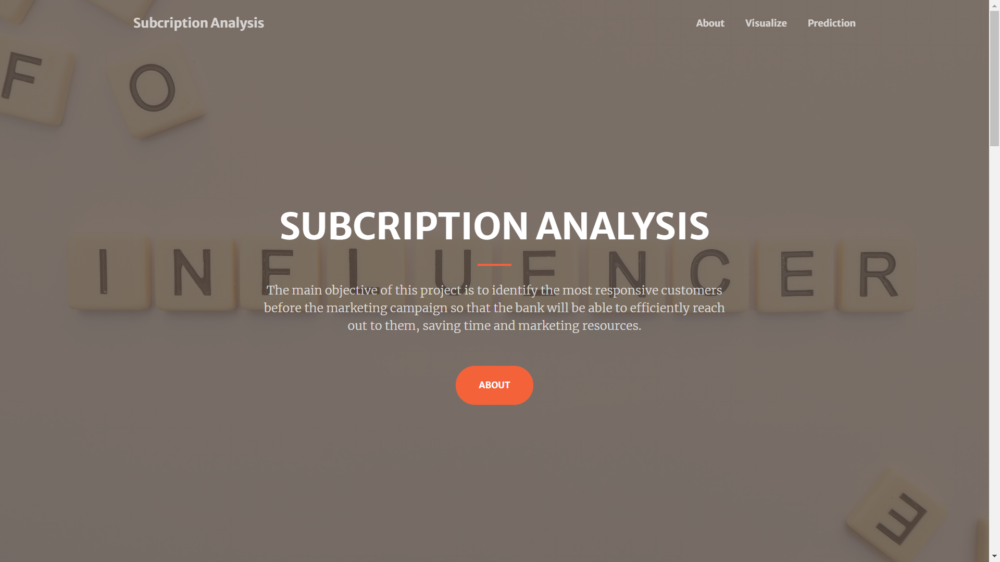
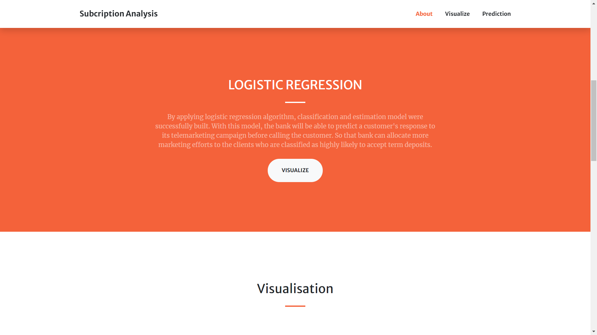
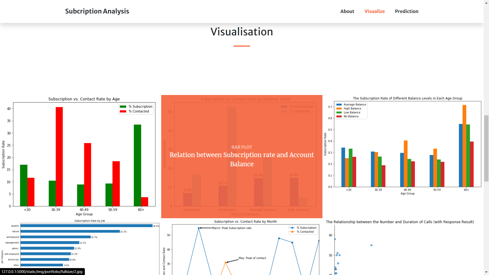

# Bank Subscribtion Model
 First project with logistic regression

This dataset is about the direct phone call marketing campaigns, which aim to promote term deposits among existing customers, by a Portuguese banking institution from May 2008 to November 2010.

Attribute Information:

Input variables:
### bank client data:
1 - age  
2 - job 
3 - marital : marital status  
4 - education  
5 - default: has credit in default?  
6 - housing: has housing loan?  
7 - loan: has personal loan?  
### related with the last contact of the current campaign:
8 - contact: contact communication type  
9 - month: last contact month of year  
10 - day_of_week: last contact day of the week 
11 - duration: last contact duration 
### other attributes:
12 - campaign: number of contacts performed during this campaign and for this client 
13 - pdays: number of days that passed by after the client was last contacted from a previous campaign 
14 - previous: number of contacts performed before this campaign and for this client 
15 - poutcome: outcome of the previous marketing campaign 
### social and economic context attributes
16 - emp.var.rate: employment variation rate 
17 - cons.price.idx: consumer price index 
18 - cons.conf.idx: consumer confidence index 
19 - euribor3m: euribor 3 month rate 
20 - nr.employed: number of employees 
###Output variable (desired target):
21 - y - has the client subscribed a term deposit? 

##Screenshots
    
    

